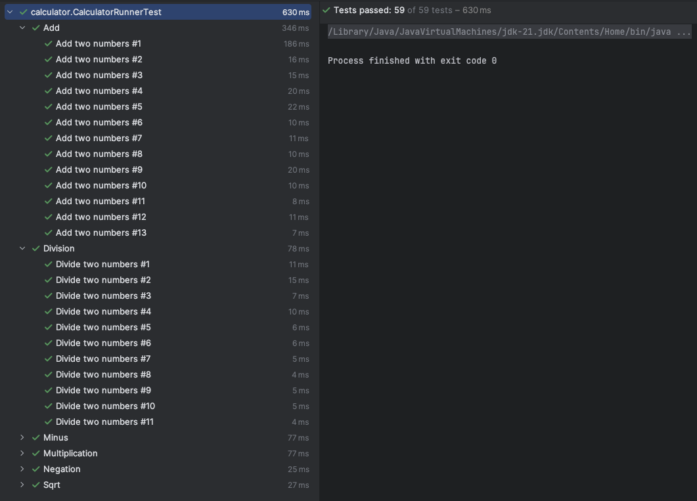
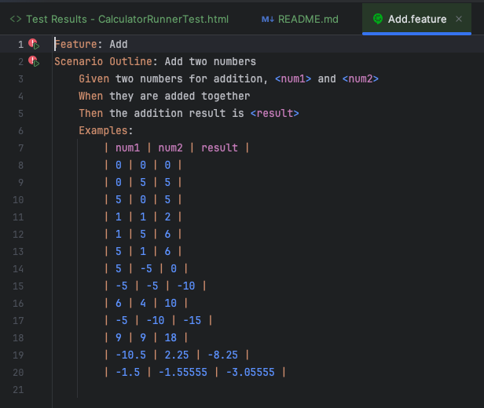
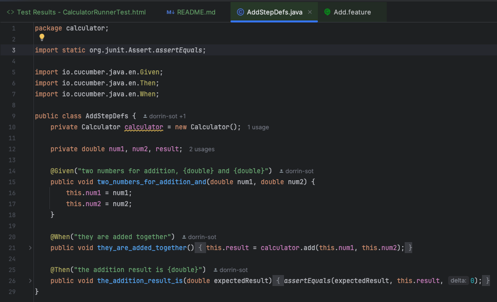
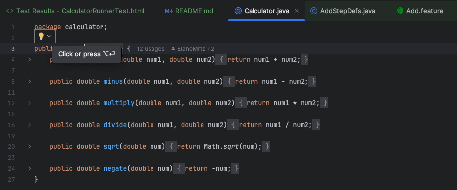

# نتایج حاصل از اجرای کلیه تست‌ها:

به صورت تصویر:

به صورت فایل HTML:

[Test Results - CalculatorRunnerTest.html](Test Results - CalculatorRunnerTest.html)

# روند پیاده‌سازی نیاز‌‌مندی‌ها با BDD

در این آزمایش یک ماشین‌حساب دارای عملگر‌های جمع، تفریق، ضرب، تقسیم، جذر، و نقیض را با روند زیر پیدسازی کردیم.
- ابتدا برای هر یک از این عملگرها یک فایل .feature ساختیم که دارای چندین سناریو مختلف که بصورت یک scenario outline نوشته شده‌اند، ساختیم.
- سپس یک فایل stepdef برای فیچر موردنظر ساختیم و جزییات هر step را پیاده‌‌سازی کردیم.
- در این مرحله اکثر تست‌ها پاس نمیشدند چچون تابع مربوط به آنها در کلاس Calculator هنوز به درستی پیاده‌‌سازی نشده بود.
- حال تابع مذکور در کلاس Calculator را یپاده‌سازی کردیم و تست‌ها پاس شدند.

